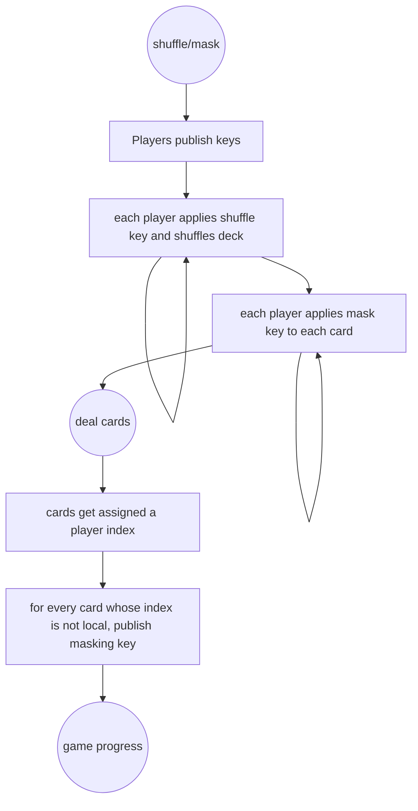

# Game state

The high level game states and transitions:



## Transition signing

```mermaid
proposalCreate-->proposalBroadcast
proposalBroadcast-->proposalReceive
proposalReceive-->proposalSign-->refresh
proposalReceive-->proposalReject-->refresh
refresh-->proposalCreate
```
