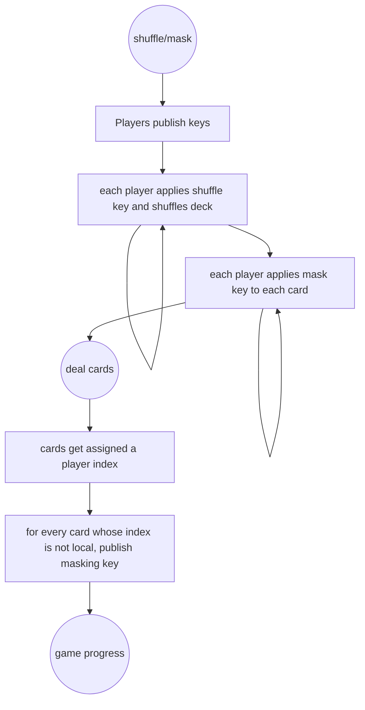

# Game state

The high level game states and transitions:



## Transition signing

```mermaid
proposalCreate-->proposalBroadcast
proposalBroadcast-->proposalReceive
proposalReceive-->proposalSign-->refresh
proposalReceive-->proposalReject-->refresh
refresh-->proposalCreate
```

## Game rules

This repository implements a game of _*Macaua*_.

- Each player is dealt 5 cards, and a card is placed face-up in the discard pile.
- Players take turns placing cards on the discard pile or picking up cards from the fresh pile until they finish the
  cards
  in their hand.
- The first player that finishes the cards in their hand wins and the game ends.
- A card placed on the discard pile must match suite or rank with the top card from the discard pile.
- Players may choose to pick the top card from the fresh pile instead of placing a card down.
- If a player cannot place any card on the discard pile, they MUST pick a fresh card.
- Challenges
  - Placing a 2, 3 or Joker card challenges the other player to pick 2, 3 or 5 fresh cards.
  - A challenged player may counter challenge by placing a 2, 3, or Joker.
  - Each counter-challenge adds to the number of fresh cards that MUST be picked.
  - The last player that cannot or does not want to counter-challenge MUST pick the number of fresh cards that were in
    the challenge.
  - A joker can be placed over any card and any card can be placed on it.
- Changing suite
  - Players may place multiple cards of the same rank in one turn as long as one of them matches suit or rank of the
    top discard, effectively changing the suite that must be matched.
  - Players may place one or more Ace cards over any card in the discard pile as long as a challenge is not ongoing
    and declare a new suite that must be matched.
  - An Ace can be placed over any card and any card matching the declared suit can be placed over it.
