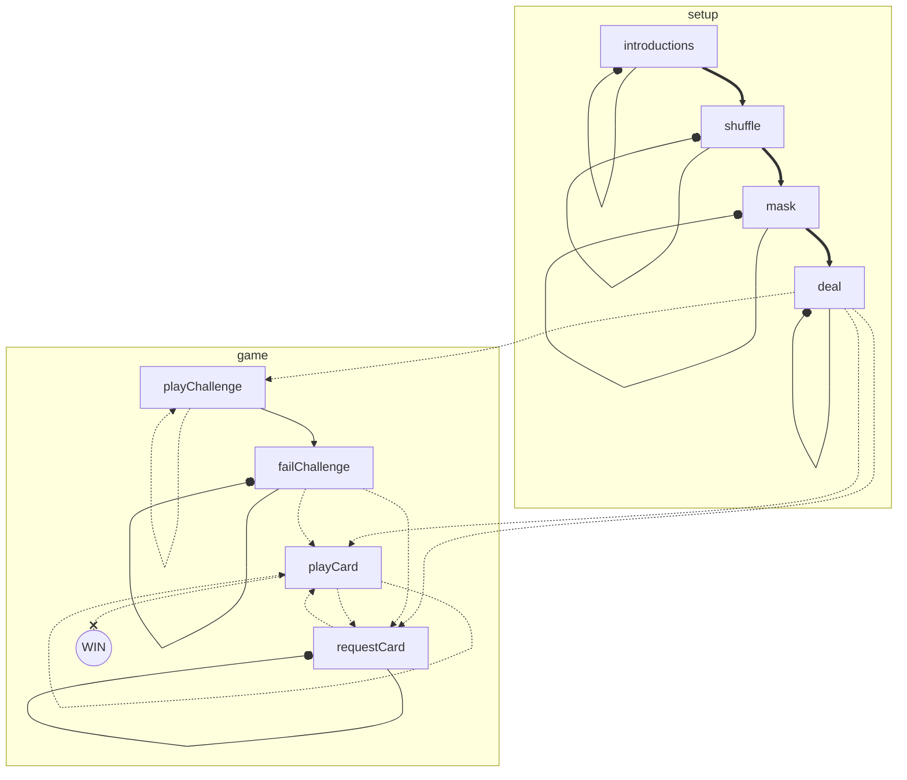
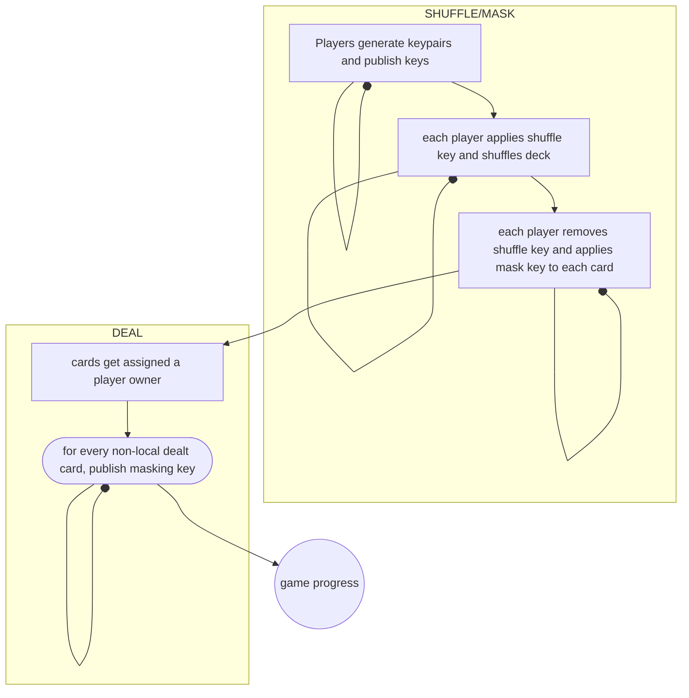
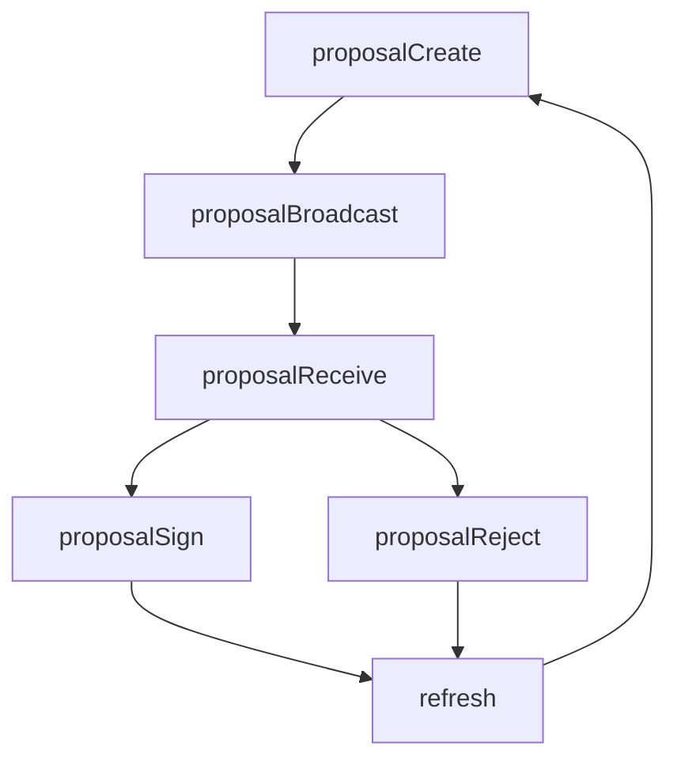

## Game state machine



The high level game states and transitions for game setup:



Each player listens to the communication channel and listen for an opportunity to make a move.
A _move_ means starting with a `GameData` object produced by the previous player, applying a transformation to it and
broadcasting the new `GameData` to the channel.

### `GameData` structures

`GameData` is a snarkyjs `Struct` that holds all the information required to know the current game state (the last move
that was made). Here is the type definition with some comments:

```typescript
/**
 * Holds the public game data
 */
export class GameData extends Struct({
  // ensures that game states are produced in sequence
  nonce: Field,
  // the index of the current player (the player that made the last move that produced this state)
  currentPlayer: Field,
  // the array of masked cards. Once shuffled, these don't change position, but they can be unmasked in place
  deck: Circuit.array<Card>(Card, CARDS_IN_DECK),
  // the array deciding where masked cards belong (which player or which pile); See `card owner constants` above.
  cardOwner: Circuit.array<Field>(Field, CARDS_IN_DECK),
  // the public keys of each player
  players: Circuit.array<PlayerKeys>(PlayerKeys, NUM_PLAYERS),
  // the private keys of each player that they share for opening cards. This structure only gets filled partially as
  // players reveal their secrets.
  playerSecrets: Circuit.array<PlayerSecrets>(PlayerSecrets, NUM_PLAYERS),
  // GameState (shuffling, dealing, playing, etc)
  gameState: Field,
  // value specific to this game
  challenge: Field,
}) {}
```

### Validation of transitions

Each player can verify that the last move was done "correctly" by calling `isValidTransition(oldGameData, newGameData)`.
This method is designed to eventually be used in a circuit.
It is a giant collection of `Bool` expressions performed over a fixed set of inputs and sprinkled with some assertions.

**State machines + circuits are hard.**

This is because all possible transitions must be checked, even when they don't make sense, because of the static nature
of a circuit.

Normally, state machines employ some mapping (switch, nested if/else, etc) for transitions that are allowed, but in the
case of circuits these would lead to different circuits being evaluated.
The alternative is to use `Circuit.if` and equivalent constructs, that evaluate both (or all) paths but only assign one
of the results.
Large(r) expressions can be built out of these constructs and transitions evaluated.

Example:
In our game, we would have to check that a player joined the game correctly.
This requires us to verify that the player publishes some public keys and does not alter any other `GameData` param.
But correctly validating this transition in a circuit also requires us to go through other verifications that don't make
sense at this stage, like correct shuffling, masking, dealing and playing.
Special care must be taken because of this as variables used in these other transition checks may not have the values
required to perform these checks.

#### Benchmark of a ZKProgram method calling assertEquals 3 times

- On m1 mac:

  - without other methods in program:
    > compile: 23069 ms;
    > prove equalities: 346759 ms;
  - with other methods in program:
    > compile: 81446 ms;
    > prove equalities: 376597 ms;

- on PC:
  - without other methods in program:
    > compile: 36469 ms;
    > prove equalities: 21439 ms;
  - with other methods in program:
    > compile: 197172 ms;
    > prove equalities: 30138 ms;

It is not (yet) reasonable to iterate using ZKPrograms and proofs directly, and it does not seem reasonable to use
ZKProgram proofs for every move in the game.

## Transition signing (TBD)


